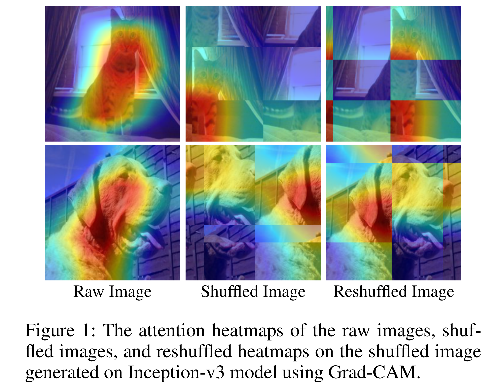

# BSR

This repository contains code to reproduce results from the paper:


[Boosting Adversarial Transferability by Block Shuffle and Rotation](https://arxiv.org/abs/2308.10299) (CVPR 2024)

Kunyu Wang, Xuanran He, Wenxuan Wang, [Xiaosen Wang](https://xiaosen-wang.github.io/)



> We also include the torch version code in the framework [TransferAttack](https://github.com/Trustworthy-AI-Group/TransferAttack).


## Requirements

+ Python >= 3.6.5
+ Keras==2.4.3
+ numpy == 1.19.2
+ Tensorflow == 2.5.0
+ scikit-image==0.19.3
+ opencv-python >= 3.4.2
+ scipy ==1.6.3
+ pandas == 1.2.4
+ imageio >= 2.6.1
+ tf-slim == 1.1.0
+ tensorflow-addons==0.14.0

## Qucik Start

### Prepare the data and models

The data and pretrained models are provided by [previous work](https://github.com/JHL-HUST/Admix). You should download them and place the data and pretrained models in dev_data/ and models/, respectively.

### BSR

All the provided codes generate adversarial examples on inception_v3 model. If you want to attack other models, replace the model in `graph` and `batch_grad` function and load such models in `main` function.

#### Runing attack

Taking BSR attack for example, you can run this attack as following:

```
CUDA_VISIBLE_DEVICES=gpuid python mi_bsr.py
```

#### Evaluating the attack

The generated adversarial examples would be stored in directory `./outputs`. Then run the file `simple_eval.py` to evaluate the success rate of each model used in the paper:

```
CUDA_VISIBLE_DEVICES=gpuid python simple_eval.py
```

## Acknowledgments

Codes refers to [Admix](https://github.com/JHL-HUST/Admix)

## Citation
If our paper or this code is useful for your research, please cite our paper.
```
@inproceedings{wang2024boosting,
     title={{Boosting Adversarial Transferability by Block Shuffle and Rotation}},
     author={Kunyu Wang and Xuanran He and Wenxuan Wang and Xiaosen Wang},
     booktitle={Proceedings of the IEEE/CVF International Conference on Computer Vision},
     year={2024}
}
```
